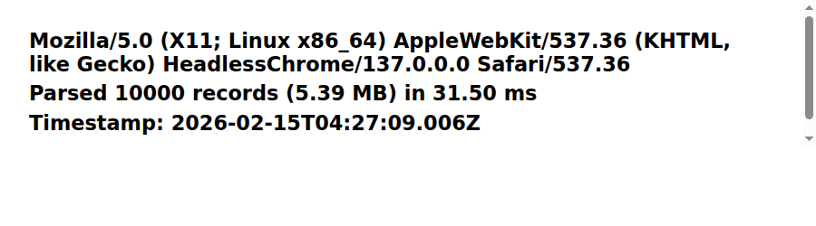
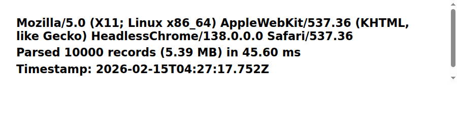
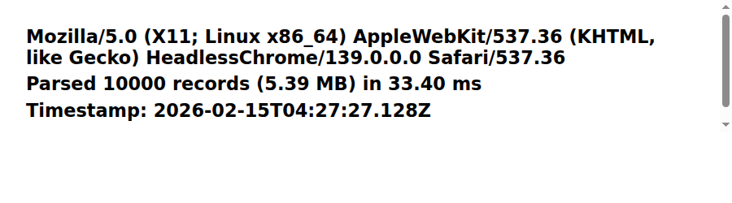
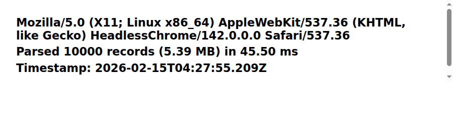
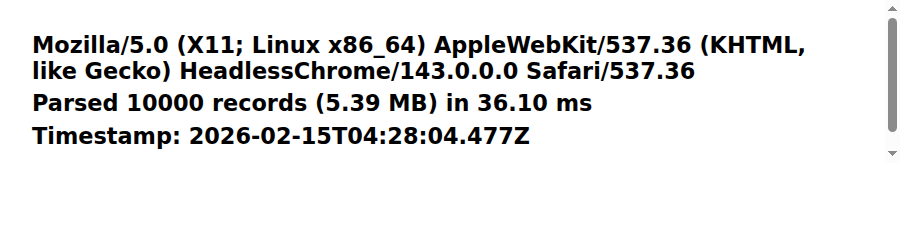
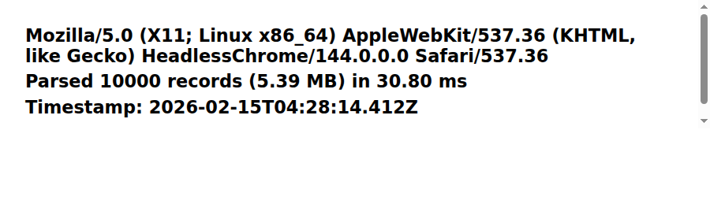

# Chrome JSON Benchmark — Last 10 Releases

Each Chrome for Testing build loads and parses a ~5.4 MB JSON document
(10,000 records) in headless mode. The screenshots show the user agent
string, parse duration, and execution timestamp.

## Chrome 136 (136.0.7103.113) — 2025-04-29

## Chrome 137 (137.0.7151.119) — 2025-05-27

## Chrome 138 (138.0.7204.183) — 2025-06-24

## Chrome 139 (139.0.7258.154) — 2025-08-05

## Chrome 140 (140.0.7339.207) — 2025-09-02

## Chrome 141 (141.0.7390.122) — 2025-09-30

## Chrome 142 (142.0.7444.175) — 2025-10-28

## Chrome 143 (143.0.7499.192) — 2025-12-02

## Chrome 144 (144.0.7559.133) — 2026-01-14

## Chrome 145 (145.0.7632.76) — 2026-02-10

