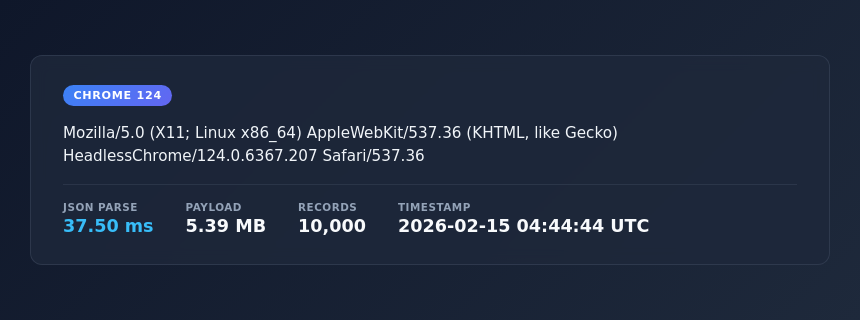
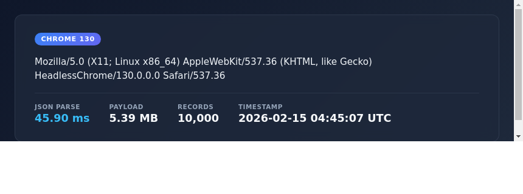
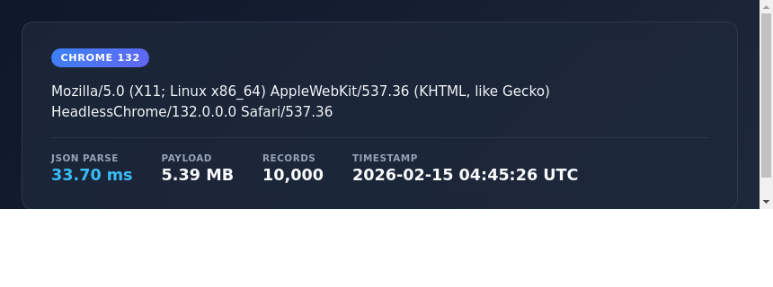
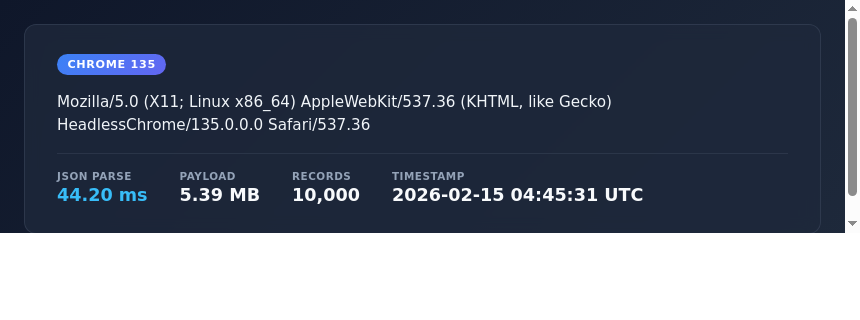

# Chrome JSON Benchmark — Last 2 Years of Releases

Each Chrome for Testing build loads and parses a ~5.4 MB JSON document
(10,000 records) in headless mode. The screenshots show the user agent
string, JSON parse duration, payload size, record count, and timestamp.

## Chrome 122 (122.0.6261.128) — 2024-02-20

## Chrome 123 (123.0.6312.122) — 2024-03-19

## Chrome 124 (124.0.6367.207) — 2024-04-16

## Chrome 125 (125.0.6422.141) — 2024-05-15

## Chrome 126 (126.0.6478.182) — 2024-06-11

## Chrome 127 (127.0.6533.119) — 2024-07-23

## Chrome 128 (128.0.6613.137) — 2024-08-21

## Chrome 129 (129.0.6668.100) — 2024-09-17

## Chrome 130 (130.0.6723.116) — 2024-10-15

## Chrome 131 (131.0.6778.264) — 2024-11-12

## Chrome 132 (132.0.6834.159) — 2025-01-14

## Chrome 133 (133.0.6943.141) — 2025-02-04

## Chrome 134 (134.0.6998.165) — 2025-03-04

## Chrome 135 (135.0.7049.114) — 2025-04-01

## Chrome 136 (136.0.7103.113) — 2025-04-29

## Chrome 137 (137.0.7151.119) — 2025-05-27

## Chrome 138 (138.0.7204.183) — 2025-06-24

## Chrome 139 (139.0.7258.154) — 2025-08-05

## Chrome 140 (140.0.7339.207) — 2025-09-02

## Chrome 141 (141.0.7390.122) — 2025-09-30

## Chrome 142 (142.0.7444.175) — 2025-10-28

## Chrome 143 (143.0.7499.192) — 2025-12-02

## Chrome 144 (144.0.7559.133) — 2026-01-14

## Chrome 145 (145.0.7632.76) — 2026-02-10

